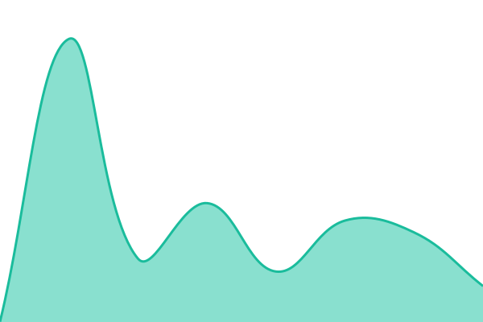
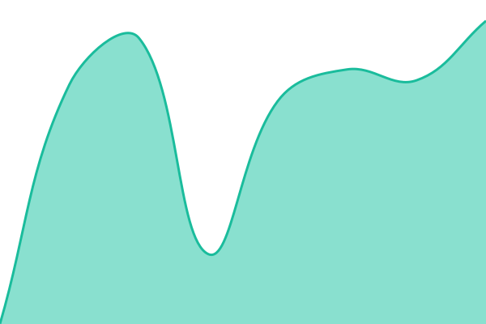
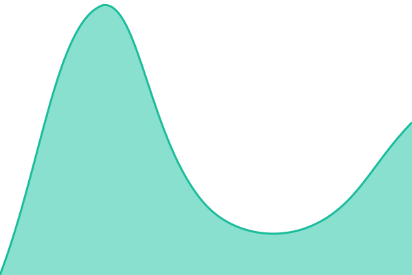
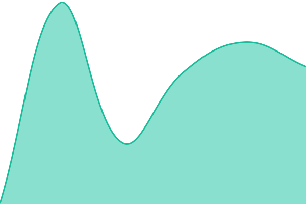
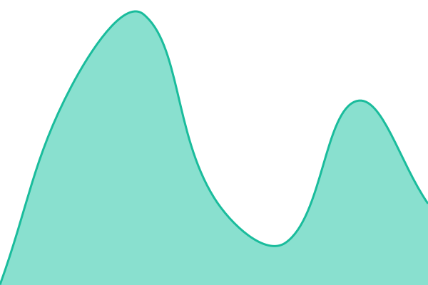
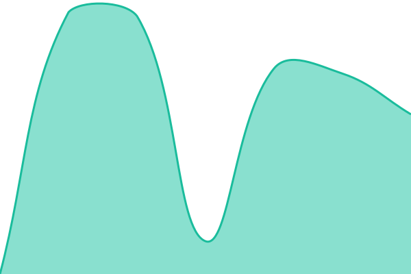

# [📈 Live Status](https://abhishekakt1.github.io/upptime): <!--live status--> **🟥 Complete outage**

This repository contains the open-source uptime monitor and status page for [abhishekakt1](https://abhishekakt1.github.io/upptime), powered by [Upptime](https://github.com/upptime/upptime).

With [Upptime](https://upptime.js.org), you can get your own unlimited and free uptime monitor and status page, powered entirely by a GitHub repository. We use [Issues](https://github.com/abhishekakt1/upptime/issues) as incident reports, [Actions](https://github.com/abhishekakt1/upptime/actions) as uptime monitors, and [Pages](https://abhishekakt1.github.io/upptime) for the status page.

<!--start: status pages-->
<!-- This summary is generated by Upptime (https://github.com/upptime/upptime) -->
<!-- Do not edit this manually, your changes will be overwritten -->
<!-- prettier-ignore -->
| URL | Status | History | Response Time | Uptime |
| --- | ------ | ------- | ------------- | ------ |
|  npm-in | 🟥 Down | [npm-in.yml](https://github.com/abhishekakt1/upptime/commits/HEAD/history/npm-in.yml) | 

 0ms
     
 | 

<a href="https://abhishekakt1.github.io/upptime/history/npm-in">0.00%</a>
    

|  npm-plex | 🟥 Down | [npm-plex.yml](https://github.com/abhishekakt1/upptime/commits/HEAD/history/npm-plex.yml) | 

 0ms
     
 | 

<a href="https://abhishekakt1.github.io/upptime/history/npm-plex">0.00%</a>
    

|  npm-us | 🟥 Down | [npm-us.yml](https://github.com/abhishekakt1/upptime/commits/HEAD/history/npm-us.yml) | 

 0ms
     
 | 

<a href="https://abhishekakt1.github.io/upptime/history/npm-us">0.00%</a>
    

|  npm-nxcloud | 🟥 Down | [npm-nxcloud.yml](https://github.com/abhishekakt1/upptime/commits/HEAD/history/npm-nxcloud.yml) | 

 0ms
     
 | 

<a href="https://abhishekakt1.github.io/upptime/history/npm-nxcloud">0.00%</a>
    

|  wiki | 🟥 Down | [wiki.yml](https://github.com/abhishekakt1/upptime/commits/HEAD/history/wiki.yml) | 

 0ms
     
 | 

<a href="https://abhishekakt1.github.io/upptime/history/wiki">0.00%</a>
    

|  ArchiePlays | 🟥 Down | [archie-plays.yml](https://github.com/abhishekakt1/upptime/commits/HEAD/history/archie-plays.yml) | 

 0ms
     
 | 

<a href="https://abhishekakt1.github.io/upptime/history/archie-plays">0.00%</a>
    

|  AudioBooks | 🟥 Down | [audio-books.yml](https://github.com/abhishekakt1/upptime/commits/HEAD/history/audio-books.yml) | 

 0ms
     
 | 

<a href="https://abhishekakt1.github.io/upptime/history/audio-books">0.00%</a>
    

|  Bazzar subtitlefkasm | 🟥 Down | [bazzar-subtitlefkasm.yml](https://github.com/abhishekakt1/upptime/commits/HEAD/history/bazzar-subtitlefkasm.yml) | 

 0ms
     
 | 

<a href="https://abhishekakt1.github.io/upptime/history/bazzar-subtitlefkasm">0.00%</a>
    

|  DR Vaultwarden | 🟥 Down | [dr-vaultwarden.yml](https://github.com/abhishekakt1/upptime/commits/HEAD/history/dr-vaultwarden.yml) | 

 0ms
     
 | 

<a href="https://abhishekakt1.github.io/upptime/history/dr-vaultwarden">0.00%</a>
    

|  DR WIKI | 🟥 Down | [dr-wiki.yml](https://github.com/abhishekakt1/upptime/commits/HEAD/history/dr-wiki.yml) | 

 0ms
     
 | 

<a href="https://abhishekakt1.github.io/upptime/history/dr-wiki">0.00%</a>
    

|  Duplicati | 🟥 Down | [duplicati.yml](https://github.com/abhishekakt1/upptime/commits/HEAD/history/duplicati.yml) | 

 0ms
     
 | 

<a href="https://abhishekakt1.github.io/upptime/history/duplicati">0.00%</a>
    

|  Graphana | 🟥 Down | [graphana.yml](https://github.com/abhishekakt1/upptime/commits/HEAD/history/graphana.yml) | 

 0ms
     
 | 

<a href="https://abhishekakt1.github.io/upptime/history/graphana">0.00%</a>
    

|  Home Assistant | 🟥 Down | [home-assistant.yml](https://github.com/abhishekakt1/upptime/commits/HEAD/history/home-assistant.yml) | 

 0ms
     
 | 

<a href="https://abhishekakt1.github.io/upptime/history/home-assistant">0.00%</a>
    

|  Jackett | 🟥 Down | [jackett.yml](https://github.com/abhishekakt1/upptime/commits/HEAD/history/jackett.yml) | 

 0ms
     
 | 

<a href="https://abhishekakt1.github.io/upptime/history/jackett">0.00%</a>
    

|  Jellyfin | 🟥 Down | [jellyfin.yml](https://github.com/abhishekakt1/upptime/commits/HEAD/history/jellyfin.yml) | 

 0ms
     
 | 

<a href="https://abhishekakt1.github.io/upptime/history/jellyfin">0.00%</a>
    

|  KASM | 🟥 Down | [kasm.yml](https://github.com/abhishekakt1/upptime/commits/HEAD/history/kasm.yml) | 

 0ms
     
 | 

<a href="https://abhishekakt1.github.io/upptime/history/kasm">0.00%</a>
    

|  KASM IN | 🟥 Down | [kasm-in.yml](https://github.com/abhishekakt1/upptime/commits/HEAD/history/kasm-in.yml) | 

 0ms
     
 | 

<a href="https://abhishekakt1.github.io/upptime/history/kasm-in">0.00%</a>
    

|  Kavita | 🟥 Down | [kavita.yml](https://github.com/abhishekakt1/upptime/commits/HEAD/history/kavita.yml) | 

 0ms
     
 | 

<a href="https://abhishekakt1.github.io/upptime/history/kavita">0.00%</a>
    

|  NXcloud | 🟥 Down | [n-xcloud.yml](https://github.com/abhishekakt1/upptime/commits/HEAD/history/n-xcloud.yml) | 

 0ms
     
 | 

<a href="https://abhishekakt1.github.io/upptime/history/n-xcloud">0.00%</a>
    

|  Plex | 🟥 Down | [plex.yml](https://github.com/abhishekakt1/upptime/commits/HEAD/history/plex.yml) | 

 0ms
     
 | 

<a href="https://abhishekakt1.github.io/upptime/history/plex">0.00%</a>
    

|  Prowlarr | 🟥 Down | [prowlarr.yml](https://github.com/abhishekakt1/upptime/commits/HEAD/history/prowlarr.yml) | 

 0ms
     
 | 

<a href="https://abhishekakt1.github.io/upptime/history/prowlarr">0.00%</a>
    

|  qBitTorrent | 🟥 Down | [q-bit-torrent.yml](https://github.com/abhishekakt1/upptime/commits/HEAD/history/q-bit-torrent.yml) | 

 0ms
     
 | 

<a href="https://abhishekakt1.github.io/upptime/history/q-bit-torrent">0.00%</a>
    

|  Radarr | 🟥 Down | [radarr.yml](https://github.com/abhishekakt1/upptime/commits/HEAD/history/radarr.yml) | 

 0ms
     
 | 

<a href="https://abhishekakt1.github.io/upptime/history/radarr">0.00%</a>
    

|  Sonarr | 🟥 Down | [sonarr.yml](https://github.com/abhishekakt1/upptime/commits/HEAD/history/sonarr.yml) | 

 0ms
     
 | 

<a href="https://abhishekakt1.github.io/upptime/history/sonarr">0.00%</a>
    

|  Tautulli | 🟥 Down | [tautulli.yml](https://github.com/abhishekakt1/upptime/commits/HEAD/history/tautulli.yml) | 

 0ms
     
 | 

<a href="https://abhishekakt1.github.io/upptime/history/tautulli">0.00%</a>
    

|  ThePugs | 🟥 Down | [the-pugs.yml](https://github.com/abhishekakt1/upptime/commits/HEAD/history/the-pugs.yml) | 

 0ms
     
 | 

<a href="https://abhishekakt1.github.io/upptime/history/the-pugs">0.00%</a>
    

|  Vaultwarden | 🟥 Down | [vaultwarden.yml](https://github.com/abhishekakt1/upptime/commits/HEAD/history/vaultwarden.yml) | 

 0ms
     
 | 

<a href="https://abhishekakt1.github.io/upptime/history/vaultwarden">0.00%</a>
    

|  MQTT | 🟥 Down | [mqtt.yml](https://github.com/abhishekakt1/upptime/commits/HEAD/history/mqtt.yml) | 

 0ms
     
 | 

<a href="https://abhishekakt1.github.io/upptime/history/mqtt">0.00%</a>
    

|  uptime | 🟥 Down | [uptime.yml](https://github.com/abhishekakt1/upptime/commits/HEAD/history/uptime.yml) | 

 0ms
     
 | 

<a href="https://abhishekakt1.github.io/upptime/history/uptime">0.00%</a>
    

|  PDF | 🟥 Down | [pdf.yml](https://github.com/abhishekakt1/upptime/commits/HEAD/history/pdf.yml) | 

 0ms
     
 | 

<a href="https://abhishekakt1.github.io/upptime/history/pdf">0.00%</a>
    

|  backup | 🟥 Down | [backup.yml](https://github.com/abhishekakt1/upptime/commits/HEAD/history/backup.yml) | 

 0ms
     
 | 

<a href="https://abhishekakt1.github.io/upptime/history/backup">0.00%</a>
    

<!--end: status pages-->

[**Visit our status website →**](https://abhishekakt1.github.io/upptime)
