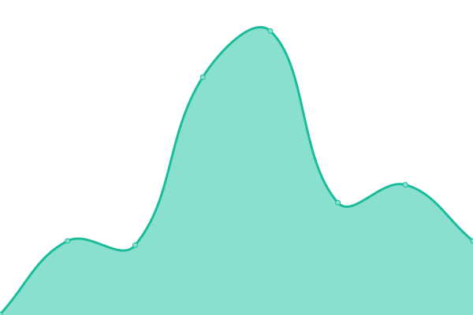

# [📈 Live Status](https://abhishekakt1.github.io/upptime): <!--live status--> **🟧 Partial outage**

This repository contains the open-source uptime monitor and status page for [abhishekakt1](https://abhishekakt1.github.io/upptime), powered by [Upptime](https://github.com/upptime/upptime).

With [Upptime](https://upptime.js.org), you can get your own unlimited and free uptime monitor and status page, powered entirely by a GitHub repository. We use [Issues](https://github.com/abhishekakt1/upptime/issues) as incident reports, [Actions](https://github.com/abhishekakt1/upptime/actions) as uptime monitors, and [Pages](https://abhishekakt1.github.io/upptime) for the status page.

<!--start: status pages-->
<!-- This summary is generated by Upptime (https://github.com/upptime/upptime) -->
<!-- Do not edit this manually, your changes will be overwritten -->
<!-- prettier-ignore -->
| URL | Status | History | Response Time | Uptime |
| --- | ------ | ------- | ------------- | ------ |
|  npm-in | 🟩 Up | [npm-in.yml](https://github.com/abhishekakt1/upptime/commits/HEAD/history/npm-in.yml) | 

 964ms
     
 | 

<a href="https://abhishekakt1.github.io/upptime/history/npm-in">100.00%</a>
    

|  npm-plex | 🟩 Up | [npm-plex.yml](https://github.com/abhishekakt1/upptime/commits/HEAD/history/npm-plex.yml) | 

 276ms
     
 | 

<a href="https://abhishekakt1.github.io/upptime/history/npm-plex">100.00%</a>
    

|  npm-us | 🟩 Up | [npm-us.yml](https://github.com/abhishekakt1/upptime/commits/HEAD/history/npm-us.yml) | 

 370ms
     
 | 

<a href="https://abhishekakt1.github.io/upptime/history/npm-us">100.00%</a>
    

|  npm-nxcloud | 🟩 Up | [npm-nxcloud.yml](https://github.com/abhishekakt1/upptime/commits/HEAD/history/npm-nxcloud.yml) | 

 986ms
     
 | 

<a href="https://abhishekakt1.github.io/upptime/history/npm-nxcloud">100.00%</a>
    

|  wiki | 🟩 Up | [wiki.yml](https://github.com/abhishekakt1/upptime/commits/HEAD/history/wiki.yml) | 

 572ms
     
 | 

<a href="https://abhishekakt1.github.io/upptime/history/wiki">100.00%</a>
    

|  ArchiePlays | 🟩 Up | [archie-plays.yml](https://github.com/abhishekakt1/upptime/commits/HEAD/history/archie-plays.yml) | 

 935ms
     
 | 

<a href="https://abhishekakt1.github.io/upptime/history/archie-plays">100.00%</a>
    

|  AudioBooks | 🟩 Up | [audio-books.yml](https://github.com/abhishekakt1/upptime/commits/HEAD/history/audio-books.yml) | 

 939ms
     
 | 

<a href="https://abhishekakt1.github.io/upptime/history/audio-books">100.00%</a>
    

|  Bazzar subtitlefkasm | 🟩 Up | [bazzar-subtitlefkasm.yml](https://github.com/abhishekakt1/upptime/commits/HEAD/history/bazzar-subtitlefkasm.yml) | 

 911ms
     
 | 

<a href="https://abhishekakt1.github.io/upptime/history/bazzar-subtitlefkasm">100.00%</a>
    

|  DR Vaultwarden | 🟩 Up | [dr-vaultwarden.yml](https://github.com/abhishekakt1/upptime/commits/HEAD/history/dr-vaultwarden.yml) | 

 1112ms
     
 | 

<a href="https://abhishekakt1.github.io/upptime/history/dr-vaultwarden">68.15%</a>
    

|  DR WIKI | 🟩 Up | [dr-wiki.yml](https://github.com/abhishekakt1/upptime/commits/HEAD/history/dr-wiki.yml) | 

 1518ms
     
 | 

<a href="https://abhishekakt1.github.io/upptime/history/dr-wiki">68.01%</a>
    

|  Duplicati | 🟩 Up | [duplicati.yml](https://github.com/abhishekakt1/upptime/commits/HEAD/history/duplicati.yml) | 

 898ms
     
 | 

<a href="https://abhishekakt1.github.io/upptime/history/duplicati">100.00%</a>
    

|  Graphana | 🟩 Up | [graphana.yml](https://github.com/abhishekakt1/upptime/commits/HEAD/history/graphana.yml) | 

 1857ms
     
 | 

<a href="https://abhishekakt1.github.io/upptime/history/graphana">100.00%</a>
    

|  Home Assistant | 🟩 Up | [home-assistant.yml](https://github.com/abhishekakt1/upptime/commits/HEAD/history/home-assistant.yml) | 

 874ms
     
 | 

<a href="https://abhishekakt1.github.io/upptime/history/home-assistant">100.00%</a>
    

|  Jackett | 🟥 Down | [jackett.yml](https://github.com/abhishekakt1/upptime/commits/HEAD/history/jackett.yml) | 

 547ms
     
 | 

<a href="https://abhishekakt1.github.io/upptime/history/jackett">0.00%</a>
    

|  Jellyfin | 🟩 Up | [jellyfin.yml](https://github.com/abhishekakt1/upptime/commits/HEAD/history/jellyfin.yml) | 

 938ms
     
 | 

<a href="https://abhishekakt1.github.io/upptime/history/jellyfin">100.00%</a>
    

|  KASM | 🟩 Up | [kasm.yml](https://github.com/abhishekakt1/upptime/commits/HEAD/history/kasm.yml) | 

 265ms
     
 | 

<a href="https://abhishekakt1.github.io/upptime/history/kasm">100.00%</a>
    

|  KASM IN | 🟥 Down | [kasm-in.yml](https://github.com/abhishekakt1/upptime/commits/HEAD/history/kasm-in.yml) | 

 366ms
     
 | 

<a href="https://abhishekakt1.github.io/upptime/history/kasm-in">0.00%</a>
    

|  Kavita | 🟩 Up | [kavita.yml](https://github.com/abhishekakt1/upptime/commits/HEAD/history/kavita.yml) | 

 928ms
     
 | 

<a href="https://abhishekakt1.github.io/upptime/history/kavita">100.00%</a>
    

|  NXcloud | 🟩 Up | [n-xcloud.yml](https://github.com/abhishekakt1/upptime/commits/HEAD/history/n-xcloud.yml) | 

 1242ms
     
 | 

<a href="https://abhishekakt1.github.io/upptime/history/n-xcloud">100.00%</a>
    

|  Plex | 🟩 Up | [plex.yml](https://github.com/abhishekakt1/upptime/commits/HEAD/history/plex.yml) | 

 908ms
     
 | 

<a href="https://abhishekakt1.github.io/upptime/history/plex">100.00%</a>
    

|  Prowlarr | 🟩 Up | [prowlarr.yml](https://github.com/abhishekakt1/upptime/commits/HEAD/history/prowlarr.yml) | 

 343ms
     
 | 

<a href="https://abhishekakt1.github.io/upptime/history/prowlarr">100.00%</a>
    

|  qBitTorrent | 🟩 Up | [q-bit-torrent.yml](https://github.com/abhishekakt1/upptime/commits/HEAD/history/q-bit-torrent.yml) | 

 882ms
     
 | 

<a href="https://abhishekakt1.github.io/upptime/history/q-bit-torrent">100.00%</a>
    

|  Radarr | 🟩 Up | [radarr.yml](https://github.com/abhishekakt1/upptime/commits/HEAD/history/radarr.yml) | 

 1099ms
     
 | 

<a href="https://abhishekakt1.github.io/upptime/history/radarr">100.00%</a>
    

|  Sonarr | 🟩 Up | [sonarr.yml](https://github.com/abhishekakt1/upptime/commits/HEAD/history/sonarr.yml) | 

 1125ms
     
 | 

<a href="https://abhishekakt1.github.io/upptime/history/sonarr">100.00%</a>
    

|  Tautulli | 🟩 Up | [tautulli.yml](https://github.com/abhishekakt1/upptime/commits/HEAD/history/tautulli.yml) | 

 841ms
     
 | 

<a href="https://abhishekakt1.github.io/upptime/history/tautulli">100.00%</a>
    

|  ThePugs | 🟥 Down | [the-pugs.yml](https://github.com/abhishekakt1/upptime/commits/HEAD/history/the-pugs.yml) | 

 0ms
     
 | 

<a href="https://abhishekakt1.github.io/upptime/history/the-pugs">0.00%</a>
    

|  Vaultwarden | 🟩 Up | [vaultwarden.yml](https://github.com/abhishekakt1/upptime/commits/HEAD/history/vaultwarden.yml) | 

 868ms
     
 | 

<a href="https://abhishekakt1.github.io/upptime/history/vaultwarden">100.00%</a>
    

|  MQTT | 🟩 Up | [mqtt.yml](https://github.com/abhishekakt1/upptime/commits/HEAD/history/mqtt.yml) | 

 158ms
     
 | 

<a href="https://abhishekakt1.github.io/upptime/history/mqtt">100.00%</a>
    

<!--end: status pages-->

[**Visit our status website →**](https://abhishekakt1.github.io/upptime)
